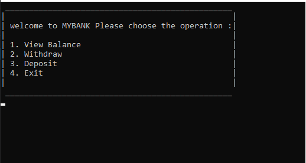
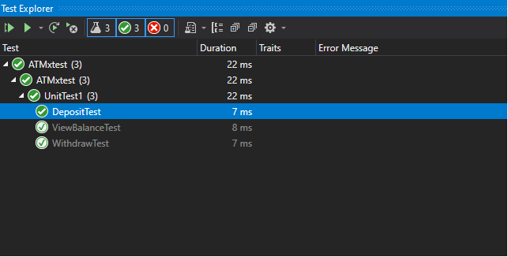

# ATM-lab02

## The purpose of the program
>The program simulates the ATM system of banks, where there is a withdrawal, deposit and balance display.

## operations:
### `ViewBalance`
Returns the value of the current balance.

### `Withdraw`
Subtracts money from the balance

### `Deposit`
Adds money to the balance

>to run this program `clone` it and open with microsoft visual studio

##  the program look like a console ATM.

## XUnit Test

